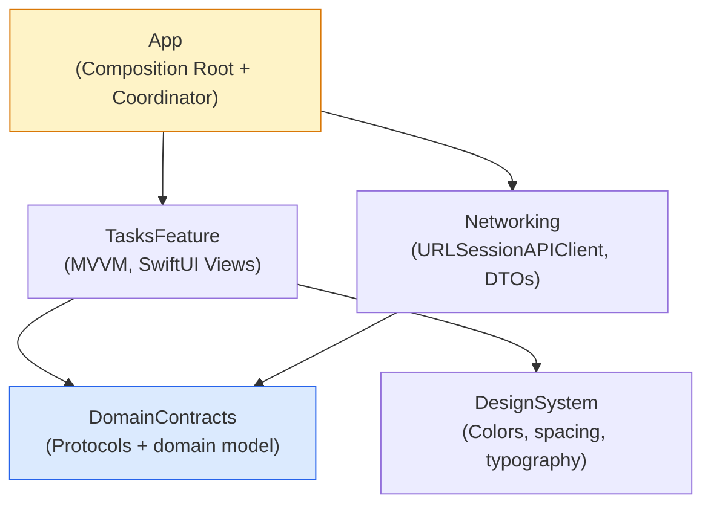
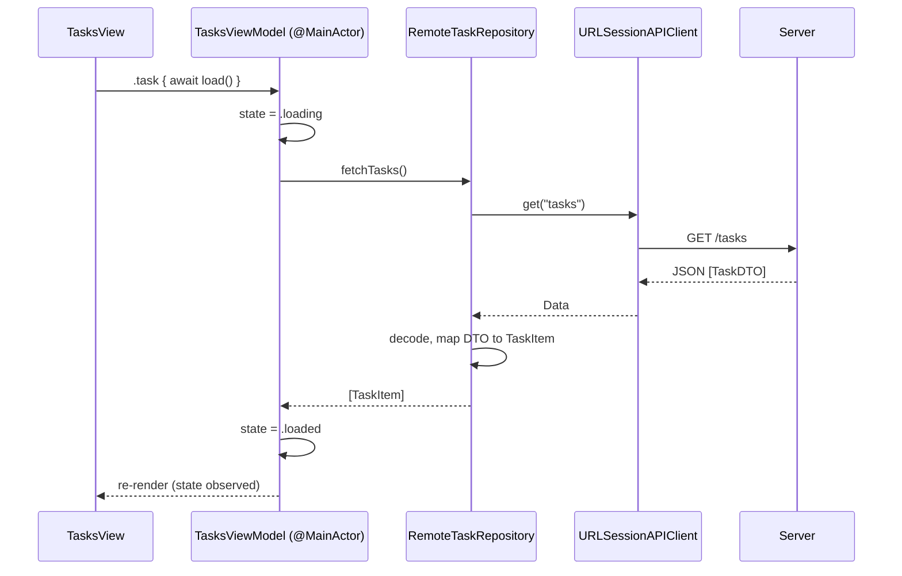
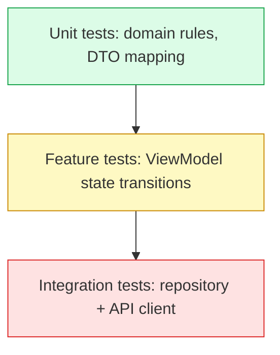

# Enterprise Tasks Architecture

**A working reference implementation of a modular, production-oriented SwiftUI architecture** — SPM module boundaries, a Composition Root, dependency inversion, MVVM, a Coordinator, DTOs with mappers, structured concurrency, automated tests, and CI-enforced architecture rules.

This isn't a tutorial repo. It is the reference implementation behind my article, *[If I Were Designing a Large-Scale SwiftUI App Today](https://medium.com/@saleemabbasfrauas/if-i-were-designing-a-large-scale-swiftui-app-today-47f157a304ae)* — every pattern described there is implemented here, compiling and tested, on a small Tasks feature kept deliberately lean enough to read in one sitting.


---

## Why this exists

Large iOS codebases rarely get hard to maintain because SwiftUI can't scale — they get hard to maintain because **dependencies stop scaling**. ViewModels start knowing too much, navigation becomes distributed, shared modules turn into dumping grounds, and a change in one feature unexpectedly breaks three others.

This repo is my answer to that: an architecture optimized for **controlled change** — the ability to modify one part of the system without forcing anyone to understand or rebuild the whole thing. Everything here is small on purpose. The point isn't the Tasks feature; it's the shape of the boundaries around it.

## Run it

```bash
git clone https://github.com/saleemabbasdev/enterprise-tasks-architecture.git
cd enterprise-tasks-architecture
swift run TasksApp   # runs the SwiftUI app on macOS, no Xcode project needed
swift test             # runs the full test suite
```

Or open `Package.swift` directly in Xcode 15.4+, or wrap it in a thin iOS App target (see [Running on iOS](#running-on-ios) below).

---

## Architecture at a glance



The dependency direction is one-way and acyclic. `DomainContracts` sits at the center with zero dependencies of its own — everything else depends on it, and it depends on nothing. `TasksFeature` cannot see `Networking` at all; it only knows the `TaskRepository` protocol. This isn't just a diagram — it's enforced two ways:

1. **By the compiler.** `Package.swift` only wires the dependencies shown above. `TasksFeature` physically cannot `import Networking` — the code wouldn't compile.
2. **By CI.** [`scripts/check-architecture.sh`](scripts/check-architecture.sh) greps for forbidden imports and fails the build if a boundary is crossed. See [`.github/workflows/ci.yml`](.github/workflows/ci.yml).

## Module map

| Module | Role | Depends on |
|---|---|---|
| `DomainContracts` | Domain model (`TaskItem`) + protocols (`TaskRepository`, `Logging`, `AnalyticsTracking`) | — |
| `Networking` | `URLSessionAPIClient`, `RemoteTaskRepository`, `TaskDTO` + mapper, `OSLogger` | `DomainContracts` |
| `DesignSystem` | Colors, spacing, typography, `PrimaryButtonStyle` | — |
| `TasksFeature` | `TasksViewModel` (MVVM), `TasksView`, semantic `TasksFeatureEvent` | `DomainContracts`, `DesignSystem` |
| `TestSupport` | `TaskRepositoryStub`, `NullLogger` — deterministic test doubles | `DomainContracts` |
| `App` | Composition Root (`AppContainer`), `AppCoordinator`, `@main` app entry | everything |

---

## How a request actually flows

What happens when the app loads the task list, end to end:



Notice `TaskDTO` never crosses out of `Networking` — the mapper turns it into `TaskItem` before the repository returns anything, so the feature layer never has to know the wire format changed.

## Where each pattern lives

| Pattern | Where | Why it's there |
|---|---|---|
| **Composition Root** | [`Sources/App/AppContainer.swift`](Sources/App/AppContainer.swift) | The one place allowed to construct concrete infrastructure. Everything downstream only sees protocols. |
| **Coordinator** | [`Sources/App/AppCoordinator.swift`](Sources/App/AppCoordinator.swift) | `TasksFeature` never navigates directly — it emits a `TasksFeatureEvent`; the coordinator decides what that means for routing. |
| **Dependency inversion** | [`TaskRepository`](Sources/DomainContracts/TaskRepository.swift) (contract) vs. [`RemoteTaskRepository`](Sources/Networking/RemoteTaskRepository.swift) (adapter) | Product logic depends on a stable capability, not on URLSession/REST specifically. |
| **MVVM** | [`TasksViewModel`](Sources/TasksFeature/TasksViewModel.swift) | `@MainActor @Observable`. The View renders state and forwards intent; the ViewModel owns presentation logic. |
| **DTO + mapper** | [`TaskDTO`](Sources/Networking/TaskDTO.swift) | An anti-corruption layer — wire format (`isDone: Int`, raw date string) never leaks into the domain model. |
| **Structured concurrency** | Throughout | `async`/`await`, `@MainActor` isolation, `Sendable` conformance on every repository and API client protocol. |
| **Deterministic test doubles** | [`TaskRepositoryStub`](Sources/TestSupport/TaskRepositoryStub.swift) | A small stub instead of a mocking framework — used across all three test targets. |
| **Architecture fitness function** | [`scripts/check-architecture.sh`](scripts/check-architecture.sh) | Automated, CI-enforced boundary checks — not just documentation. |
| **AI-agent boundaries** | root [`CLAUDE.md`](CLAUDE.md) + scoped `CLAUDE.md` in [`TasksFeature`](Sources/TasksFeature/CLAUDE.md) and [`Networking`](Sources/Networking/CLAUDE.md) | Module-scoped rules so an AI coding agent (or a new hire) can't accidentally violate a boundary it doesn't know exists. |

## Testing strategy



More tests and faster feedback at the base, fewer and broader at the top. All three levels exist here — see [`Tests/`](Tests). Written in XCTest for broad Xcode compatibility; the assertions translate directly to Swift Testing (`@Test`/`#expect`) if you're on Xcode 16+.

## CI/CD

Every push runs [`.github/workflows/ci.yml`](.github/workflows/ci.yml): build, test, then an architecture boundary check. A pull request that violates a module boundary fails CI before a human ever has to catch it in review.

---

## Running on iOS

This is a pure Swift Package — no `.xcodeproj` — so `swift run` gives you a macOS window. To see it in the iOS Simulator:

1. Create a new Xcode iOS App project.
2. File → Add Package Dependencies → Add Local... → select this folder, and link the `DomainContracts`, `Networking`, `DesignSystem`, and `TasksFeature` products to your app target.
3. Replace your generated `@main` App file with the composition root:

```swift
import SwiftUI

@main
struct TasksDemoApp: App {
    private let container: AppContainer

    init() {
        container = AppContainer.live()
    }

    var body: some Scene {
        WindowGroup {
            RootView(container: container)
        }
    }
}
```

4. Copy `AppContainer.swift`, `AppCoordinator.swift`, and `RootView.swift` from [`Sources/App`](Sources/App) into your new project as plain source files, confirm their Target Membership is checked for your app target, and run.

## What's intentionally left out

This is a lean demo, not a full app: no persistence layer, no auth feature, no real backend (the API client points at `https://api.example.com`, which doesn't exist — the loading-then-error path is expected, and is itself proof the DTO/repository/error-handling wiring works end to end). The goal is to show the *shape* of the architecture, not ship a product.

## Roadmap

The architecture reference is complete and tested. These product capabilities are intentionally reserved for future iterations:

- [ ] Add an executable iOS sample target for one-click Simulator runs
- [ ] Replace the example endpoint with a small deployable backend
- [ ] Add authentication and secure token storage
- [ ] Introduce local persistence and offline synchronization
- [ ] Add request tracing, metrics, and production observability adapters
- [ ] Migrate XCTest suites to Swift Testing in a Swift 6/Xcode 16 branch
- [x] Publish the [companion Medium article](https://medium.com/@saleemabbasfrauas/if-i-were-designing-a-large-scale-swiftui-app-today-47f157a304ae)

---

## About this project

I write about iOS architecture and building maintainable Swift codebases. This repository is the implementation behind my article, *[If I Were Designing a Large-Scale SwiftUI App Today](https://medium.com/@saleemabbasfrauas/if-i-were-designing-a-large-scale-swiftui-app-today-47f157a304ae)*. I'm currently open to senior iOS, mobile platform, and architecture-focused roles.

**Suggested resume line:**
> Designed and implemented a modular SwiftUI reference architecture (SPM module boundaries, Composition Root, MVVM, Coordinator, dependency inversion, structured concurrency, automated testing, CI-enforced architecture rules) demonstrating production-grade patterns for large-scale iOS codebases.

## License

MIT — see [`LICENSE`](LICENSE).
